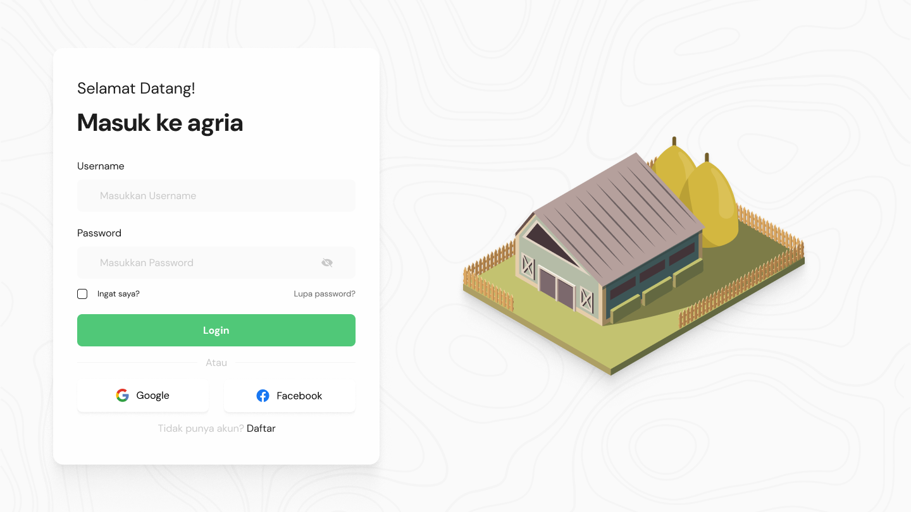
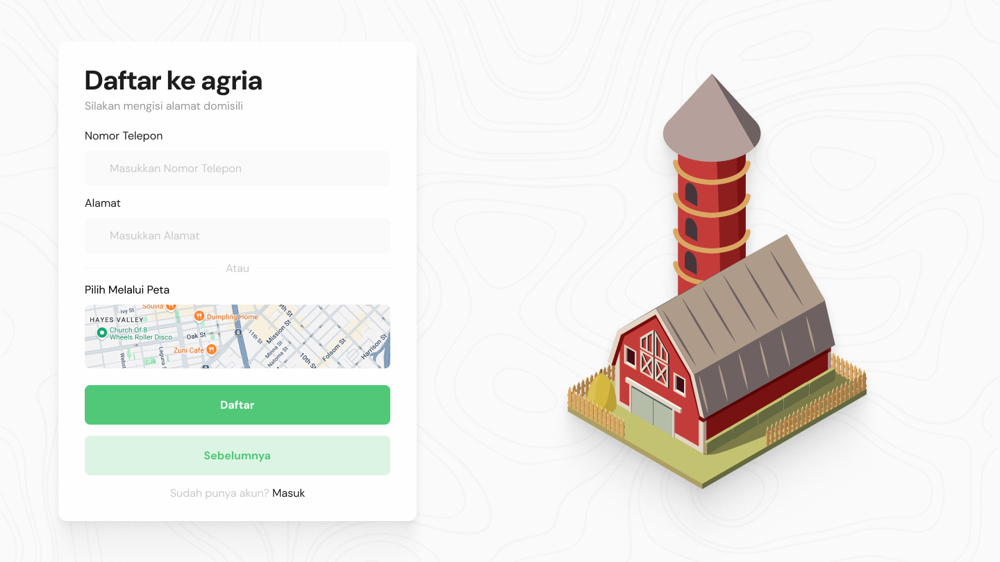
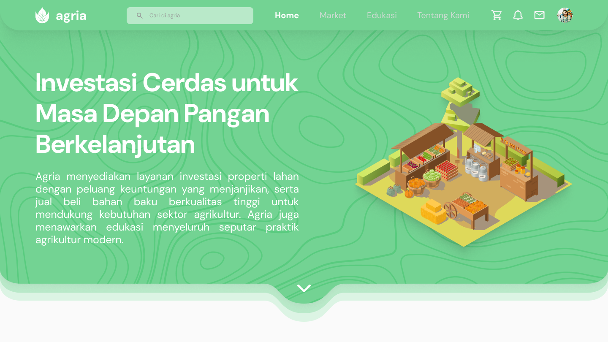
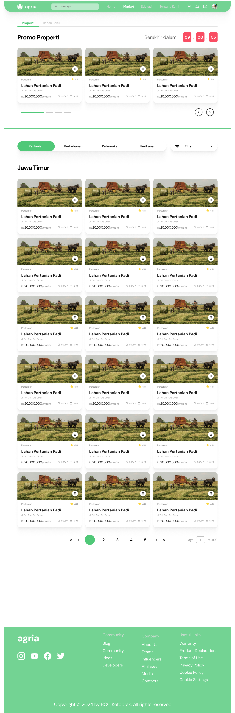
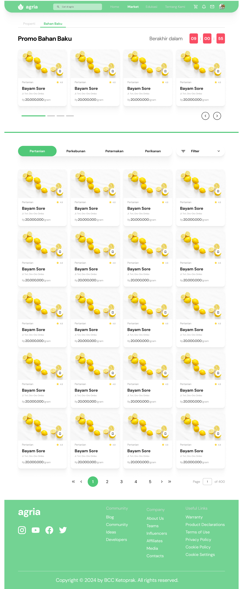
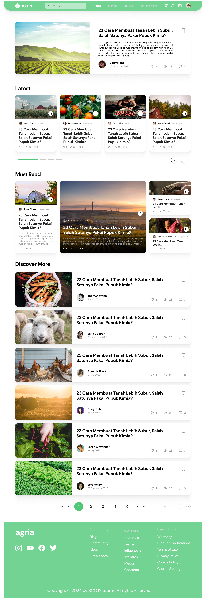

# Agria Frontend

## 📌 Live Demo

https://agria-pi.vercel.app/

*Development Progress*

- [x] Landing Page
- [x] Login Page
- [x] Register Page
- [x] Home Page
- [x] Land Leasing Page
- [x] Yields Trading Page
- [x] Education Page
- [ ] Profile Page
- [x] API Integration

*PROGRESS: 88%*

## 🗂 Index

- [📌 Live Demo](#-live-demo)
- [🗂 Index](#-index)
- [🔧 Development Overview](#-development-overview)
  - [🛠 Tech Stack](#-tech-stack)
- [🖼 Gallery](#-gallery)
- [🌟 Credits](#-credits)
- [🔒 License](#-license)

## 🔧 Development Overview

This section provides details about the development of Agria's frontend.

### 🛠 Tech Stack

Here are the key technologies used in building the frontend:

| Technology              | Purpose                                                    |
|-------------------------|------------------------------------------------------------|
| *React*                | Frontend framework for building the user interface         |
| *Tailwind CSS*         | For building a responsive and customizable UI                |
| *Vite.js*              | For fast and optimized frontend build tooling                |
| *React Router*         | For managing client-side routing in the frontend           |
| *Axios*                | For making API requests from the frontend to the backend   |
| *React Router DOM*     | For client-side routing between pages                        |

## 🖼 Gallery

Screenshots of the application's current development progress:

## 🌟 Credits

1. Muhammad Rafly Ash Shiddiqi
2. Humaam Ahmad Yaasiin
3. Rashky Rahmadian Jauhara

## 🔒 License

© BCC Ketoprak - 2024
